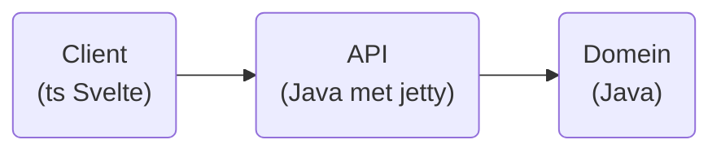

# IP Paulus: Rummikub

Het bekende spel waarin je steentjes met nummers en kleurtjes erop moet sorteren. De speler die zijn steentjes als eerste zijn steentjes kwijt is heeft gewonnen.

[Spelregels](https://rummikub.com/wp-content/uploads/2019/12/2600-English-1.pdf): deze regels zullen de leidraad vormen van mijn spel.

## Doelstellingen (MoSCoW)

### Must

- Het spel heeft een front end met een drag-and-drop interface om steentjes te groeperen in het midden.
- Eén speler kan een spel spelen.
    - De score is dan het aantal beurten dat je nodig hebt (lager is beter).
- Het spel is afgelopen als het plankje leeg is van een speler

### Should

- Meerdere spelers kunnen hotseat op één computer spelen
    - Aan het eind van het spel wordt de score dan berekend aan de hand van de steentjes die nog op de plankjes van niet-winnende spelers liggen.
- Het spel kan opgeslagen worden in een database en later hervat worden

### Could

- Meerdere spelers kunnen online een spel spelen
- Een knop om automatisch je plankje te sorteren zodat series of rijtjes zichtbaar worden.
- High scores

### Would like

- Een AI om tegen te spelen
- Een functionaliteit om de speler hints te geven

## Architectuur

Zo mogelijk zou ik ook een onaf spel en/of highscores willen opslaan. Ik heb nog geen keuze gemaakt welk type database hiervoor het meest geschikt is, en waar deze dan het beste in de architectuur zou passen.

## Leerdoelen

### Persoonlijke leerdoelen

- Volledige CI/CD pipeline doorlopen inclusief deployment op (Heroku) server
- Het project goed modelleren en documenteren in een Readme
- Werken in sprints, met aan het einde van iedere week 
- Gebruik maken van de issue tracker

### Technische leerdoelen

- Svelte goed begrijpen
- Het implementeren van drag & drop functionaliteiten in de front end
- Een goed doordachte API met DTO's die 
- Jenkins gebruiken voor CI/CD (of een ander alternatief op Gitlab CI)
- Serieuzer gebruik maken van een SQL database en dit integreren in de CI/CD pipeline
