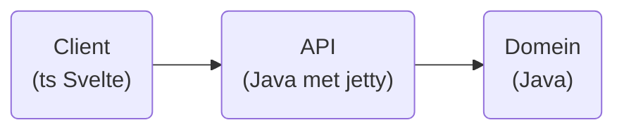

# IP Paulus: Rummikub

Het bekende spel waarin je steentjes met nummers en kleurtjes erop moet sorteren. De speler die zijn steentjes als eerste zijn steentjes kwijt is heeft gewonnen.

## Spelregels

- Het spel is speelbaar voor 1 of meer spelers.
- Spelers beginnen met een plankje dat alleen voor hunzelf zichtbaar is met daarop 14 stenen.
- Een steen heeft een cijfer en een kleur.
  - De cijfers lopen van 1 t/m 13.
  - Er zijn vier kleuren (in principe zwart, rood, blauw, geel).
  - Er zijn twee jokers (dit kan later geïmplementeerd worden).
  - Het spel bevat 106 stenen: twee keer 1-13 in elk van de vier kleuren, plus twee jokers.
- Een speler die aan de beurt is moet een of meer stenen op tafel leggen.
- Tijdens zijn beurt mag een speler sets opnieuw arrangeren.
- Alle stenen op tafel moeten zich in een valide set bevinden.
- Een valide set is een valide serie of rij bestaande uit drie of meer stenen.
  - Een valide serie bestaat uit een sequentie van oplopende getallen in dezelfde kleur zonder tussenliggende getallen.
  - Een valide rij is een sequentie van stenen in elk verschillende kleuren met hetzelfde getal.
- Een beurt is voltooid als een speler minimaal één steen heeft toegevoegd aan de tafel en als alle stenen zich in een valide set bevinden.
- Kan de speler dit niet, dan moet hij één steen uit de pot pakken.
- Als een speler aan het einde van zijn beurt...
  - geen stenen op zijn plank heeft, dan heeft hij gewonnen.
  - wel stenen op zijn plank heeft, dan geeft hij de beurt door aan de volgende speler.

Speciale dingen (kan later geïmplementeerd worden)

- Joker: een steen die een cijfer en kleur naar keuze van de speler met beurt kan aannemen. Als deze opnieuw wordt gearrangeerd mag hij een nieuw cijfer en een nieuwe kleur krijgen.
- Uitkomen: als een speler nog niet eerder stenen heeft toegevoegd aan de tafel, dan moet de som van de cijfers van de aangelegde stenen minimaal dertig zijn en mag de speler niet aanleggen aan reeds gelegde stenen.
- Opmaken score aan einde spel: als een speler gewonnen heeft nemen de andere spelers de som van de cijfers op hun plankje

[Spelregels (Engels)](https://rummikub.com/wp-content/uploads/2019/12/2600-English-1.pdf): deze regels zullen de leidraad vormen van mijn spel.
Daarnaast zijn [hier](https://rummikub.com/wp-content/uploads/2019/12/2600-Dutch_German_French_Spanish.pdf) Nederlandstalige spelregels te vinden.

## Doelstellingen (MoSCoW)

### Must

- Het spel heeft een front end met een interface om steentjes te groeperen in het midden.
- Eén speler kan een spel spelen.
  - De score is dan het aantal beurten/stenen dat je nodig hebt (lager is beter).
- Het spel is afgelopen als het plankje leeg is van een speler.

### Should

- Meerdere spelers kunnen hotseat op één computer spelen.
  - Aan het eind van het spel wordt de score dan berekend aan de hand van de steentjes die nog op de plankjes van niet-winnende spelers liggen.
- Het spel kan opgeslagen worden in een database en later hervat worden.

### Could
- Maak een spel herspeelbaar door de methodie die de pot schudt een seed mee te geven.
- Meerdere spelers kunnen online een spel spelen.
- Een knop om automatisch je plankje te sorteren zodat series of rijtjes zichtbaar worden.
- De mogelijkheid om een arbitrair aantal kleuren en steentjes per kleur te kiezen.
- High scores.

### Would like

- Een AI om tegen te spelen.
- Een functionaliteit om de speler hints te geven.

## Architectuur

Ik manage het project in Maven. De Java wordt geverifieerd met JUnit tests, Jacoco test coverage reports en een Checkstyle file.

Voor mijn CI/CD pipeline zou ik graag Jenkins willen leren, maar wellicht is het qua tijd die ik krijg verstandiger om weer Gitlab CI te gebruiken.

Zo mogelijk zou ik ook een onaf spel en/of highscores willen opslaan. Ik heb nog geen keuze gemaakt welk type database hiervoor het meest geschikt is, en waar deze dan het beste in de architectuur zou passen.

## Leerdoelen

### Persoonlijke leerdoelen

- Volledige CI/CD pipeline doorlopen inclusief deployment op (Heroku) server.
- Het project goed modelleren en documenteren in een Readme.
- Werken in sprints, met aan het einde van iedere week .
- Gebruik maken van de issue tracker.
- Beter gebruik maken van branching in git. Alleen committen naar main via merge requests (niet direct), en alleen merge requests doen bij het behalen van milestones.

### Technische leerdoelen

- Svelte goed begrijpen
- Het implementeren van drag & drop functionaliteiten in de front end.
- Een goed doordachte API met DTO's die de alle benodigde informatie doorstuurt, maar niet meer dan dat.
- Jenkins gebruiken voor CI/CD (of een ander alternatief op Gitlab CI).
- Serieuzer gebruik maken van een SQL database en dit integreren in de CI/CD pipeline.

## Deliverables

### Week 0

- ~~Uitkiezen onderwerp~~
- ~~Opzetten project~~
- ~~Skelet voor frontend~~

### Week 1
- ~~Er is een Maven projectstructuur voor het domein en de API.~~
- ~~Er zijn steentjes verzameld in een pot~~
- ~~Er is een speler en deze kan steentjes uit de pot halen.~~
- ~~Er is een Set object en de speler kan hier steentjes in leggen~~
- ~~Een Set kan controleren of deze valide is~~
- ~~De speler kan zijn beurt afsluiten.~~
  - ~~Hij kan aan de tafel vragen of hij geen niet-valide sets bevat.~~ 
  - ~~De tafel kan aan ieder steentje vragen of hij zich in een valide set bevindt.~~
- ~~Een client kan de API vragen om zijn plankje en de tafel~~
- ~~Een client kan de verplaatsing van een steen en een verzoek om de beurt af te sluiten doorgeven aan de API~~
- ~~Het plankje en de tafel zijn gevisualiseerd in een website.~~
- Een speler kan met point & click stenen verplaatsen
- Het antwoord op de vraag of de tafel geen niet-valide sets bevat is zichtbaar voor de gebruiker.

### Week 2
- ~~Een speler met beurt kan de spelsituatie resetten naar het begin van zijn beurt.~~
- ~~Een speler kan zijn beurt doorgeven aan de volgende speler.~~
- ~~Regels voor uitkomen zijn geïmplementeerd~~
  - ~~Een speler kan pas uitkomen als hij dertig punten toevoegt aan de tafel~~
  - ~~Een speler mag bij het uitkomen geen bestaande sets manipuleren~~
- ~~Een speler mag steentjes die hij binnen zijn beurt op tafel heeft gelegd vóór het einde van zijn beurt terugleggen op zijn plankje, maar geen andere steentjes (het spel is zonder deze feature speelbaar door te resetten)~~
- Bug fixes, QA, etc.

