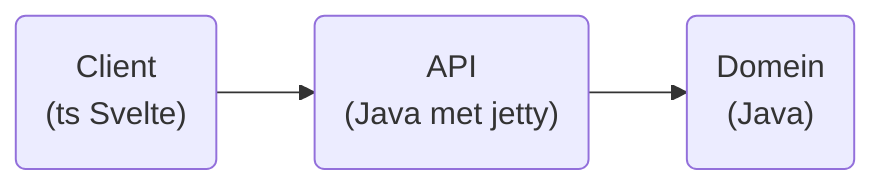

# IP Paulus

## Het kernidee
Mogelijke eindprojecten: 
- Cynghanedd calculator: check of een Welshe poëzieregel in cynghanedd is, en zoja welke
- Linear B hangman: galgje spelen met Myceens Griekse woorden in het originele schrift
- Nahuatl numbers: ontvang een integer 0-159999 en geef daarvan de representatie in het Klassiek Nahuatl
- Fidchell: het Ierse bordspel.
- Mancala met *n* spelers.
- Maak je eigen IE taal: formuleer klankwetten en kijk wat de reflexen zijn van IE wortels en formaties in deze taal.

Met een cynghanedd calculator kun je een corpus aan Welshe versregels geven om te checken en te displayen. Met hangman kun je Myceense woorden in een database opslaan. Met fidchell kun je misschien een onaf spel opslaan en laden.

## Architectuur

De plek en de implementatie van de database is nog onbekend.

## Leerdoelen

### Persoonlijke leerdoelen

- Volledige CI/CD pipeline doorlopen inclusief deployment op (Heroku) server
- Het project goed modelleren en documenteren in een Readme
- Werken in sprints, met aan het einde van iedere week 
- Gebruik maken van de issue tracker

### Technische leerdoelen

- Svelte goed begrijpen
- Jenkins gebruiken voor CI/CD (of een ander alternatief op Gitlab CI)
- Serieuzer gebruik maken van een SQL database en dit integreren in de CI/CD pipeline
