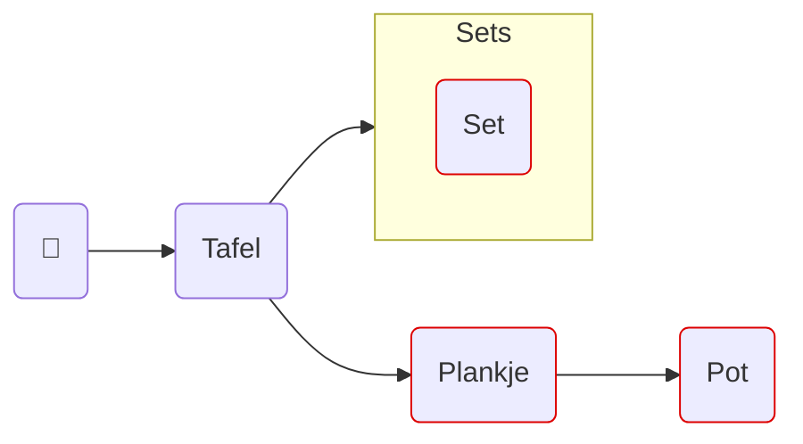
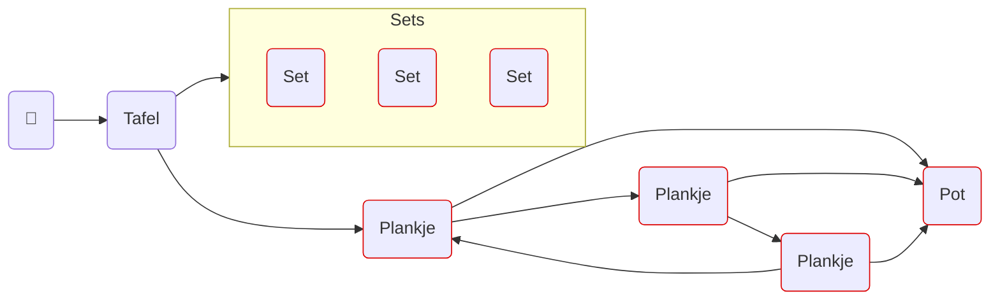

# Overzicht van objecten in verschillende scenario's
Een pijl tussen objecten kan gelezen worden als: een object kent het object waar de pijl naar wijst.

De emoji van een persoon verwijst naar het punt waarmee een agent buiten het domein met het domein interacteert.

Een roodomlijnd object kan Stenen bevatten.
## Eén Speler en één Set op Tafel

## Drie Spelers en drie Sets op Tafel

