# Overzicht van objecten in verschillende scenario's
Een pijl tussen objecten kan gelezen worden als: een object kent het object waar de pijl naar wijst.

De emoji van een persoon verwijst naar het punt waarmee een agent buiten het domein met het domein interacteert.

Een roodomlijnd object kan Stenen bevatten.
## Eén Speler en één Set op Tafel

```mermaid
flowchart LR

AGENT("🧍")
TAFEL("Tafel")
SPELER("Speler")
PLANKJE("Plankje"):::heeftStenen
POT("Pot"):::heeftStenen
subgraph Sets
SET1("Set"):::heeftStenen
end

AGENT-->TAFEL
TAFEL-->SPELER
SPELER-->PLANKJE
PLANKJE-->POT
SPELER-->SPELER
TAFEL-->Sets


classDef heeftStenen stroke:#d00
```

## Drie Spelers en drie Sets op Tafel

```mermaid
flowchart LR

AGENT("🧍")
TAFEL("Tafel")


SPELER1("Speler")
PLANKJE1("Plankje"):::heeftStenen

SPELER2("Speler")
PLANKJE2("Plankje"):::heeftStenen

SPELER3("Speler")
PLANKJE3("Plankje"):::heeftStenen


POT("Pot"):::heeftStenen
subgraph Sets
SET1("Set"):::heeftStenen
SET2("Set"):::heeftStenen
SET3("Set"):::heeftStenen
end

AGENT-->TAFEL
TAFEL-->SPELER1
TAFEL-->Sets
SPELER1-->PLANKJE1
SPELER2-->PLANKJE2
SPELER3-->PLANKJE3
SPELER1-->SPELER2
SPELER2-->SPELER3
SPELER3-->SPELER1
PLANKJE1-->POT
PLANKJE2-->POT
PLANKJE3-->POT

classDef heeftStenen stroke:#d00
```

