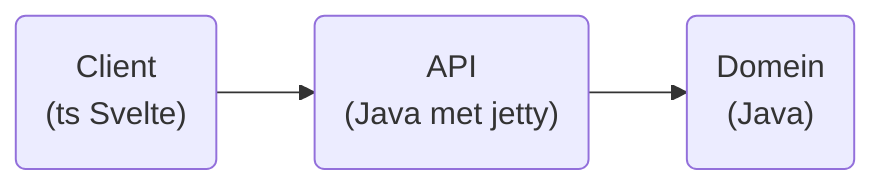

# IP Paulus: Rummikub

---

# Het spel

---

# Leerdoelen

## Technisch

## Persoonlijk

---

# Architectuur

```mermaid
flowchart LR
    FRONT("Client <br> (ts Svelte)")
    API("API <br> (Java met jetty)")
    DOM("Domein <br> (Java)")
    FRONT-->API
    API-->DOM
```

---

# Java objecten

---

# Svelte

---

# DDD inzichten
